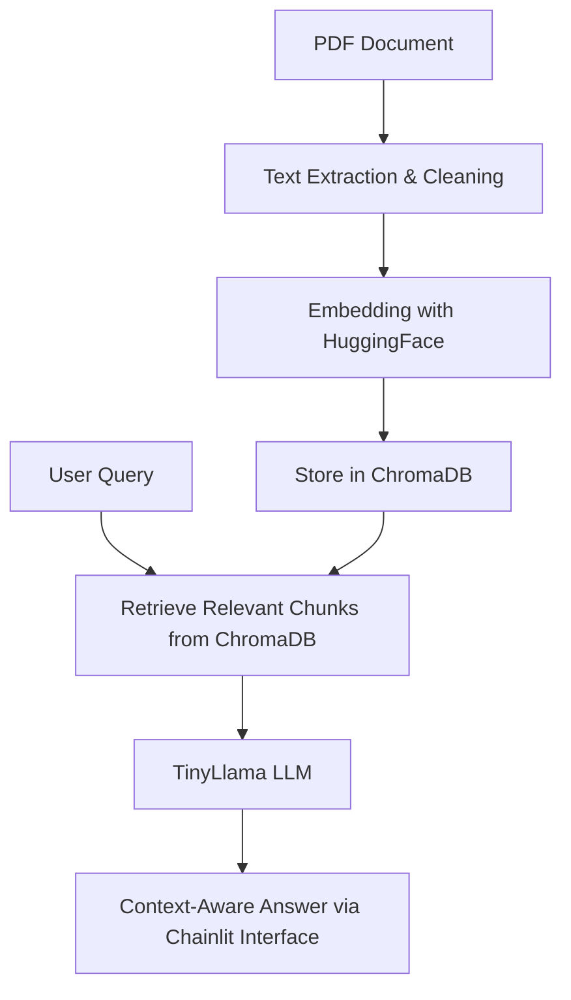
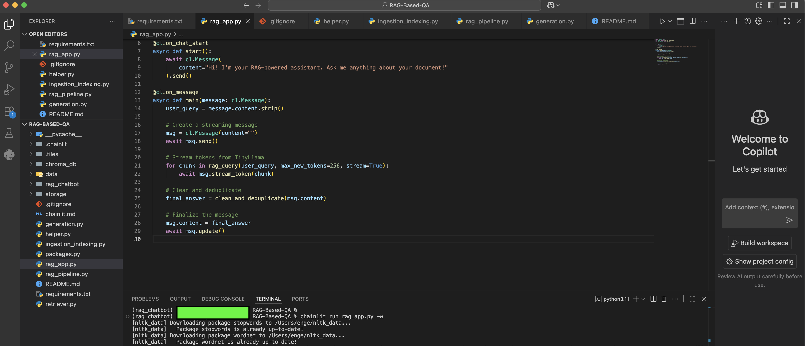
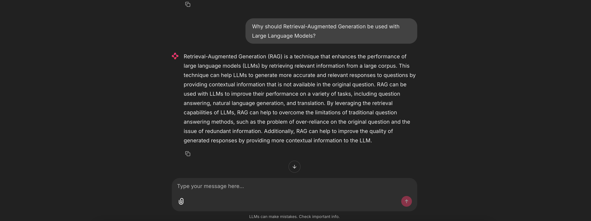

# RAG-Based PDF Question Answering 

This project implements a Retrieval-Augmented Generation (RAG) pipeline for querying PDF documents in natural language, accessible via a conversational interface built with Chainlit. PDF text is extracted, cleaned, and embedded into a ChromaDB vector store. At query time, semantically relevant chunks are retrieved and passed to a lightweight LLM (TinyLlama), which generates accurate, context-aware answers grounded in the source documents.


## How It Works

The RAG pipeline processes PDF documents and serves answers via a Chainlit interface. The flow is illustrated below:


### Pipeline Flow



## Features

- Query PDF documents in natural language
- Retrieve semantically relevant chunks with RAG
- Generate concise, context-aware answers using TinyLlama
- Conversational interface with Chainlit
- Lightweight setup with CPU-friendly LLM
- Supports streaming responses


## Why TinyLlama?

We use TinyLlama (1.1B) as the language model because it is:
- Lightweight and CPU-friendly → runs without requiring a GPU.
- Efficient for prototyping and small-scale applications.
- Fast enough for interactive chat through Chainlit.

This choice was motivated by computer performance constraints. The design, however, is modular, so swapping in a larger model is straightforward if more compute is available.


## Token Limits

- By default, the system limits generated answers to ``256 tokens`` (``max_new_tokens=256`).
- This keeps responses concise and prevents overly long generations.
- You can adjust this parameter in ``rag_query()`` or ``generate_stream()`` if you need longer answers.


## Example Interaction

Below is an example of how the RAG-powered chatbot responds to questions about PDF documents:



You can see how the assistant retrieves context from the documents and provides concise, accurate answers.

This illustrates the streaming response and context-aware behavior of the model.





## Installation

1. Clone the repository
```bash
git clone https://github.com/Engelbert107/RAG-Based-QA.git
```

```bash
cd RAG-Based-QA
```

2. Create a virtual environment
```bash
python -m venv venv
```
3. Activate the virtual environment

- On macOS/Linux:
```bash
source venv/bin/activate
```

- On Windows:
```bash
venv\Scripts\activate
```

4. Install your packages
```bash
pip install -r requirements.txt
```


## Usage

```bash
chainlit run rag_app.py -w
```


## Project Structure

```bash
.
├─ data
│  └─ RAGForLLM.pdf             
├─ images
│  ├─ Run.png
│  ├─ Q1.png
│  └─ Q2.png          
├─ rag_app.py          
├─ rag_pipeline.py     
├─ generation.py       
├─ retriever.py        
├─ helper.py          
├─ storage/            
├─ chroma_db/          
└─ README.md
```


## Example Data

This project includes the following open-access paper as a sample dataset:

**Retrieval-Augmented Generation for Large Language Models: A Survey**  
*Yunfan Gao, Yun Xiong, Xinyu Gao, Kangxiang Jia, Jinliu Pan, Yuxi Bi, Yi Dai, Jiawei Sun, Meng Wang, Haofen Wang*  
[arXiv link](https://arxiv.org/abs/2312.10997)

The PDF version of this paper is provided under `data/RAGForLLM.pdf` for demonstration purposes.

