# RAG-Based Question Answering from PDF

This project implements a Retrieval-Augmented Generation (RAG) pipeline for querying PDF documents in natural language, accessible via a conversational interface built with Chainlit. PDF text is extracted, cleaned, and embedded into a ChromaDB vector store. At query time, semantically relevant chunks are retrieved and passed to a lightweight LLM (TinyLlama), which generates accurate, context-aware answers grounded in the source documents.

## 🔄 How It Works

The RAG pipeline processes PDF documents and serves answers via a Chainlit interface. The flow is illustrated below:

### Pipeline Flow

```mermaid
flowchart TD
    A[📄 PDF Document] --> B[🔍 Text Extraction & Cleaning]
    B --> C[📦 Embedding with HuggingFace]
    C --> D[🗂️ Store in ChromaDB]
    E[❓ User Query] --> F[🔎 Retrieve Relevant Chunks from ChromaDB]
    F --> G[🤖 TinyLlama LLM]
    D --> F
    G --> H[✅ Context-Aware Answer via Chainlit Interface]
```



## 💻 Features

- Query PDF documents in natural language
- Retrieve semantically relevant chunks with RAG
- Generate concise, context-aware answers using TinyLlama
- Conversational interface with Chainlit
- Lightweight setup with CPU-friendly LLM
- Supports streaming responses


### Example Interaction

Below is an example of how the RAG-powered chatbot responds to questions about PDF documents:


You can see how the assistant retrieves context from the documents and provides concise, accurate answers.

This illustrates the streaming response and context-aware behavior of the model.


## ⚙️ Installation

```bash
git clone https://github.com/Engelbert107/RAG-Based-QA.git
```

```bash
cd RAG-Based-QA
```

```bash
python -m venv venv
```

```bash
source venv/bin/activate
```

```bash
pip install -r requirements.txt
```


## 🚀 Usage

```bash
chainlit run rag_app.py -w
```


## 🛠️ Project Structure

.
├─ data/               # PDF files
├─ images/             # Example screenshots
├─ rag_app.py          # Chainlit app
├─ rag_pipeline.py     # RAG query logic
├─ generation.py       # TinyLlama text generation
├─ retriever.py        # Vector store retriever
├─ helper.py           # Text cleaning, processing functions
├─ storage/            # Persisted index
├─ chroma_db/          # ChromaDB storage
└─ README.md

